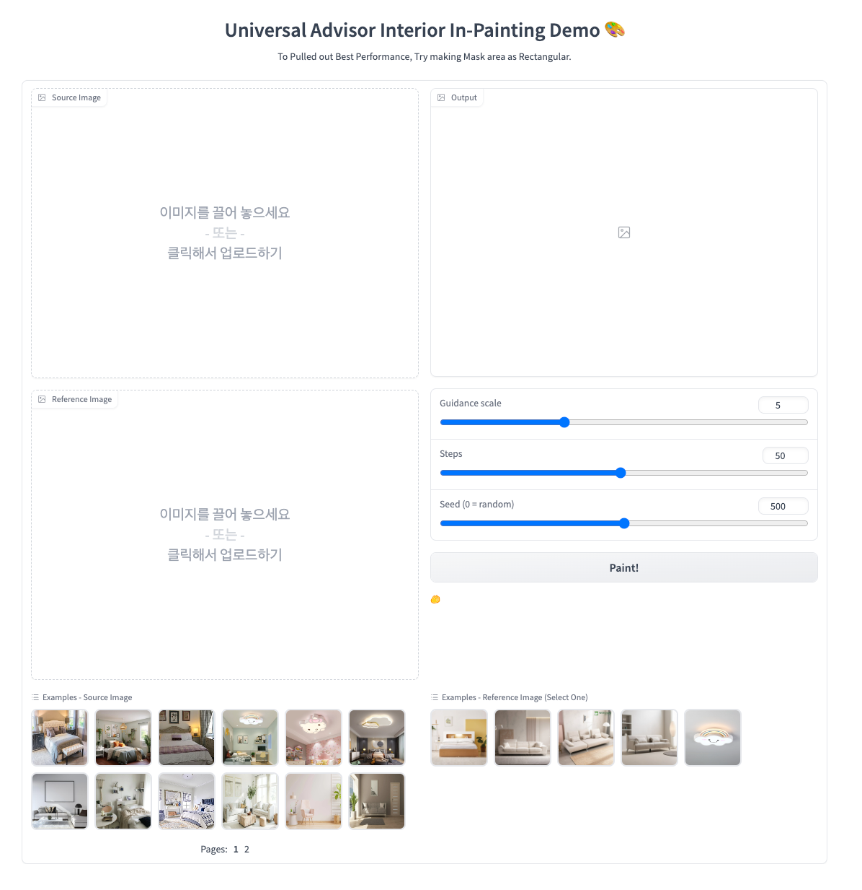

# NSU-Interior Inpainting Demo


## Requirements
A suitable [conda](https://conda.io/) environment named `interior-inpaint` can be created
and activated with:

```
conda env create -f environment.yaml
conda activate interior-inpaint
```

## Demo Link
Without Creating own repository, Demo is also available on following link. \
[Demo Link](http://kubeflow.aisuite.navercorp.com/port-expose/sangbeom/demo/interior_inpainting/) 


## Pretrained Model
Demo is available for 5 interior object of 3 classes. `sofa`, `bed`, `lamp` \
For Now, Each object need individual model for inpainting.
```
cd ../experiments/
c3s-hdfs-connector-0.7/bin/hdfs-connector -get hdfs://jmt/user/sangbeom/aisuite/experiments/*
```

## Run Demo
```
python demo.py
```
Demo Page link is set `localhost:1784` default.

## Usage
Upload or Select Example image placed on bottom. Demo need manual masking action. \
Please Mask source image by drawing on source image using your mouse. \
Clink & Hold to draw mask area on source!
\
\
Choose Reference image placed on bottom. \
Each image is mapped to fine-tuned model.
\
\
Clink `PAINT!` to get result!