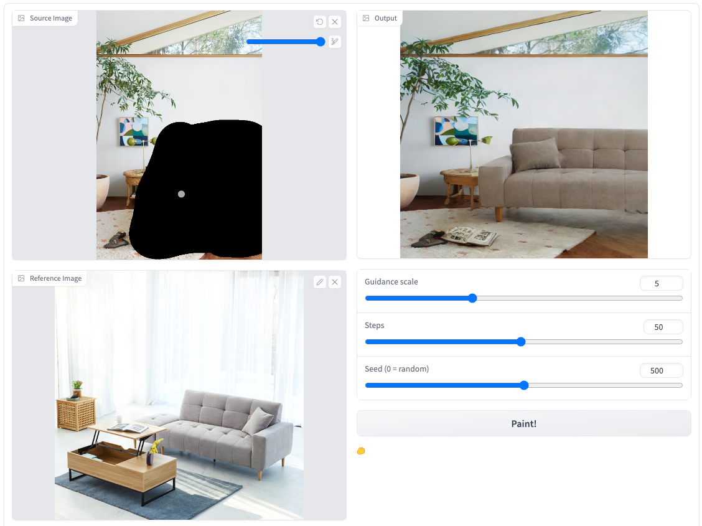
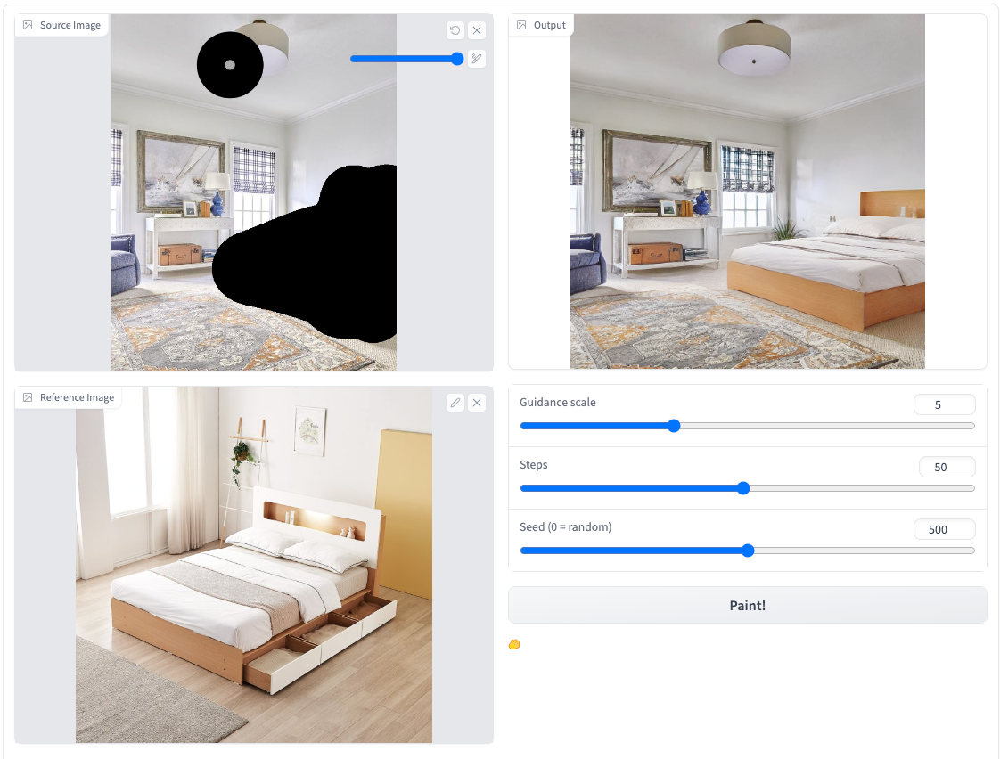
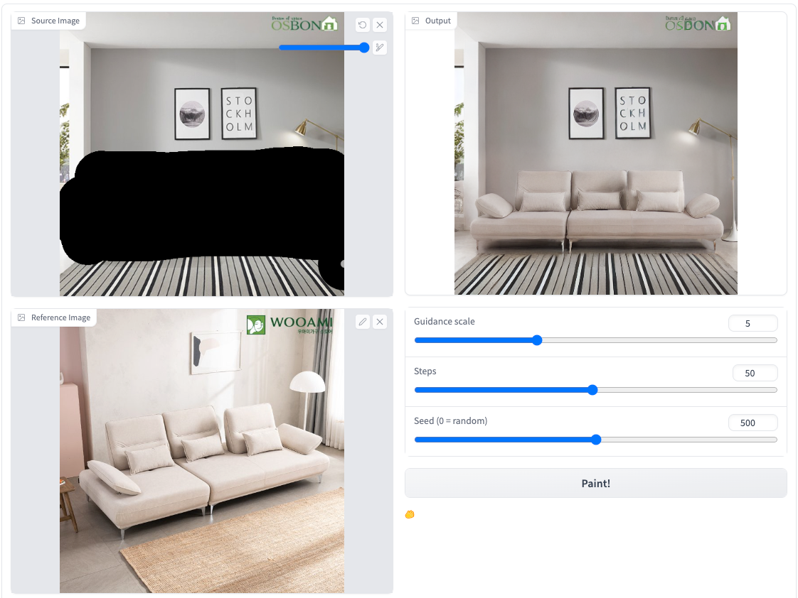

# Image Guided Inpainting with Personalized Diffusion Model using LoRA

## Requirements
A suitable [conda](https://conda.io/) environment named `interior-inpaint` can be created
and activated with:

```
conda env create -f environment.yaml
conda activate interior-inpaint
```

## Demo
Demo is available on [demo repository](https://oss.navercorp.com/sangbeom-lim/image_editing_demo)
Or Online Demo is also available on following Link!
#### [Demo Link](http://kubeflow.aisuite.navercorp.com/port-expose/sangbeom/demo/interior_inpainting/)

## Samples




## Training


### Download the pretrained model of Lsun-Bedroom
```
cd pretrained_models/
c3s-hdfs-connector-0.7/bin/hdfs-connector -get hdfs://jmt/user/sangbeom/aisuite/pretrained_models/*
```
Or
#### Download the pretrained model of Stable Diffusion
We utilize the pretrained Stable Diffusion v1-4 as initialization, please download the pretrained models from [Hugging Face](https://huggingface.co/CompVis/stable-diffusion-v-1-4-original) and save the model to directory `pretrained_models`. Then run the following script to add zero-initialized weights for 5 additional input channels of the UNet (4 for the encoded masked-image and 1 for the mask itself).
```
python scripts/modify_checkpoints.py
```

## Dataset
LSUN-Bedroom Datset

| Dataset       | Explanation | Usage | Image Size | Resolution |
|---------------|-------|-------|------------|------------|
| Lsun-Bedroom  | Datset of various Bedroom state  | Detect Interior object & Crop for self-supervise learning  |      300,000      |    265, 357        |

Download Dataset from here! [Kaggle Download Link](https://www.kaggle.com/datasets/jhoward/lsun_bedroom)

### Training Paint by Example
To train a new model, you can use `main.py`. For example,
```
python -u main.py \
--logdir experiments/fine_tune/efficient/cloud_lamp \
--pretrained_model pretrained_model/lsun_pretrained_model.ckpt \
--base configs/finetune_efficient.yaml \
--scale_lr False
```

The Model structure is below:
```
InversionLatentDiffusion(DDPM)
├── cond_stage_model(FrozenCLIPEmbedderFineTune)
│  ├── text_model(FrozenCLIPTextEmbedder)
│  ├── image_model(FrozenCLIPImageEmbedder)
├── model(DiffusionWrapper)
│  ├── Diffusion_model(UNetModel)
│  │  ├── input_blocks
│  │  ├── middle_block
│  │  ├── output_blocks
├── proj_out(nn.Linear)
```

## Inference

To sample from our model, you can use `scripts/inference_caption.py`. For example, 
```
python scripts/inference_caption.py --plms \
--outdir results/ --config configs/finetune_efficient.yaml \
--ckpt model_path --scale 5 --image_path livingroom.jpg --mask_path livingroom.png \
--reference_path sofa.jpg --gpu true \
--class_type sofa
```

### Parameter Efficient Fine-Tuning
Lookup table for parameters updated during fine-tuning stage,
[Update Table](https://samintern.atlassian.net/wiki/spaces/INTERSHIP/pages/24772621/Parameter+Efficient+Finetuning+Update+Ratio).

Freezing Diffusion Model(UNetModel) blocks while fine-tune leaving some layers(Or Block) unfreezed. \
Related File freezing UNetModel -> [openaimodel.py](ldm/modules/diffusionmodules/openaimodel.py), 
[ddpm.py](ldm/models/diffusion/ddpm.py)


**Applicating LORA Method to diffusion model while fine-tuning -> [Parameter Efficient Finetuning](https://github.com/SangbeomLim/Parameter-efficient-finetuning)**


